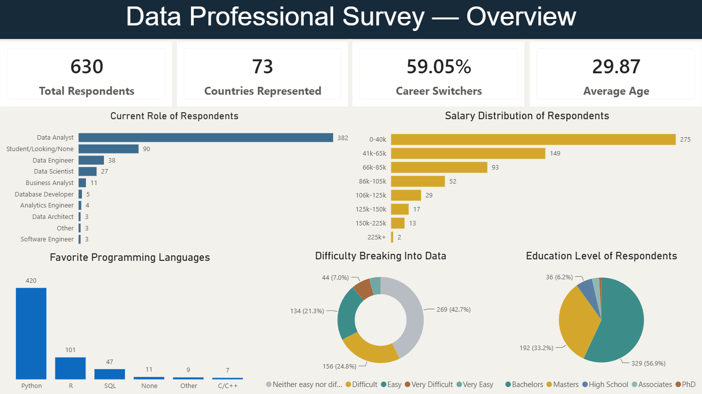
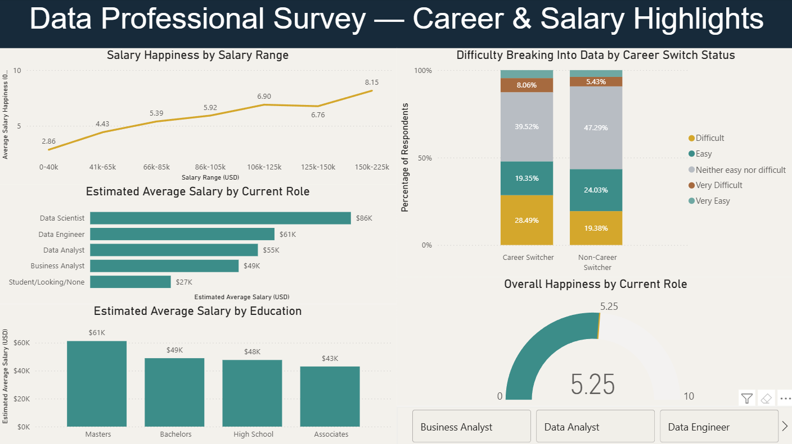

# Data Professional Survey Analysis

An end-to-end data analytics project analyzing 630 survey responses from data professionals to explore career paths, salaries, job satisfaction, and demographic trends.

This project covers the complete analytics workflow, from data validation and cleaning to exploratory data analysis using MySQL and SQL, followed by the development of an interactive Power BI dashboard.

**Tools:** MySQL | SQL | Power BI | DAX


## Dashboard Preview

### Survey Overview



### Career & Salary Highlights




## Project Overview

The goal of this project was to transform a raw survey dataset into a well-structured, analysis-ready dataset and use it to investigate different patterns across the careers of data professionals.

The project followed an end-to-end analytics workflow:

1. **Validated and imported the raw data** into MySQL.
2. **Cleaned and standardized the dataset** using SQL, including high-cardinality free-text responses, categorical values, missing and ambiguous responses, multiple data types, and different salary ranges.
3. **Performed exploratory data analysis (EDA)** to examine respondent demographics, career backgrounds, salaries, industries, programming languages, education, and job satisfaction.
4. **Investigated relationships between variables**, including career switching and difficulty entering data, salary and education, salary and job satisfaction, overall happiness scores, and differences across roles and countries.
5. **Built an interactive Power BI dashboard** to present and visualize the most important patterns and findings in an accessible format.

The analysis was designed not only to describe the survey population, but also to explore relationships within the data while accounting for different sample sizes and the limitations of self-reported survey responses.


## Dataset

The project uses the **Data Professional Survey** dataset, which contains **630 survey responses** from individuals across a range of data-related careers and backgrounds.

The survey includes information on:

- Current role and career-switching status
- Yearly salary range
- Industry
- Favorite programming language
- Happiness across salary, work-life balance, coworkers, management, upward mobility, and learning opportunities
- Difficulty breaking into the data field
- Priorities when searching for a new job
- Age, gender, country, education, and ethnicity

The original dataset was published by **Alex the Analyst** as part of his Power BI materials and is available in his public GitHub repository.

**Original Dataset:** [AlexTheAnalyst/Power-BI — Power BI Final Project](https://github.com/AlexTheAnalyst/Power-BI/blob/main/Power%20BI%20-%20Final%20Project.xlsx)

The dataset was used as the starting point for this project. The **data validation, MySQL/SQL cleaning pipeline, exploratory data analysis, analytical approach, DAX measures, and Power BI dashboard in this repository were developed independently**.


## Tools & Technologies

- **MySQL** — Data storage, validation, cleaning, transformation, and exploratory data analysis
- **SQL** — Data cleaning, handling blanks and NULL values, categorical and free-text standardization, feature engineering, validation, and analytical queries
- **Power BI** — Data modeling, interactive dashboard development, and data visualization
- **DAX** — Custom measures, filter-context calculations, and interactive analytical metrics


## Data Cleaning & Analysis

### Data Cleaning & Preparation

The raw survey data required substantial cleaning and standardization before analysis. The cleaning process was performed in MySQL using SQL while preserving the original raw data and creating multiple separate staging tables for different transformations.

Key cleaning steps included:

- **Validated data integrity during import.** An initial import contained only 612 of the 630 source responses. The issue was traced to blank values in several happiness-rating fields being imported with incompatible numeric handling. The data was re-imported with the affected fields initially stored as text, preserving all 630 responses for cleaning and analysis.
- **Checked for duplicate responses** using respondent information and survey answers rather than relying only on unique respondent IDs.
- **Standardized high-cardinality free-text responses** across fields such as current role, industry, programming language, job priority, country, and ethnicity while preserving meaningful distinctions between the respondents' answers.
- **Handled blanks, NULLs, and ambiguous responses** according to their meaning. Genuine missing or unusable responses were converted to `NULL`, while valid responses such as `Other` or `None` were retained where appropriate.
- **Standardized data types and formats**, including survey dates, times, and numerical happiness scores.
- **Engineered salary features** from the original salary ranges by creating minimum, maximum, and midpoint salary fields for analytical comparisons while retaining the original salary-range categories.
- **Validated the final cleaned dataset**, confirming 630 unique respondent IDs and checking that numerical fields and happiness scores remained within expected ranges.

### Exploratory Data Analysis

After cleaning and validating the dataset, exploratory data analysis was performed in MySQL using SQL. The analysis began by establishing baseline distributions before investigating the relationships between different survey variables.

The analysis covered:

- **Respondent profile** — Current roles, age, gender, education, country, and career-switching status
- **Career landscape** — Role distribution, industries, programming languages, and difficulty breaking into data
- **Salary patterns** — Salary distributions and estimated salary differences across roles, education levels, and countries
- **Career switching** — Comparison of reported difficulty breaking into data between career switchers vs non-career switchers
- **Job satisfaction** — Salary happiness across salary ranges and overall happiness across current roles
- **Industry and geography** — Industry representation across countries and gender representation across industries
- **Sample-size-aware comparisons** — Minimum respondent thresholds were applied to selected analyses to reduce the influence of very small groups

For salary-based comparisons, midpoint estimates were calculated from the survey's salary ranges. The open-ended `225k+` category was retained in the dataset but excluded from midpoint-based calculations because a representative upper bound could not be determined.


## Key Findings

- **Career switching was common:** 59.05% of respondents reported switching careers into data. Career switchers were also more likely to describe breaking into data as Difficult or Very Difficult (36.55%) compared with non-career switchers (24.81%).

- **Python was the dominant programming language:** 66.67% of respondents selected Python as their favorite programming language, substantially ahead of R (16.03%) and SQL (7.46%).

- **Salary by role:** Data Scientists reported the highest estimated average salary (~$86K), followed by Data Engineers (~$61K) and Data Analysts (~$55K) among roles with at least 10 respondents.

- **Higher salary ranges generally corresponded with greater salary satisfaction:** Average salary happiness increased from 2.86/10 among respondents earning $0–40K to 8.15/10 among those earning $150–225K.

- **Overall happiness varied across major roles:** Data Scientists reported the highest average overall happiness score at 6.12/10, while respondents categorized as Student/Looking/None reported the lowest at 3.70/10.

- **Industry patterns across countries:** Technology was among the top three industries in every country analyzed and was the leading industry in Canada, Germany, India, Nigeria, and the United Kingdom.


## Project Structure

```text
data-professional-survey-analysis/
├── sql/
│   ├── 01_data_cleaning.sql
│   └── 02_exploratory_data_analysis.sql
├── dashboard/
│   └── data_professional_survey_dashboard.pbix
├── images/
│   ├── overview_dashboard.png
│   └── career_salary_highlights.png
└── README.md
```

## Limitations

- The survey is a self-reported sample and thus it should not be treated as representative of the entire data profession.
- The respondent pool is heavily concentrated among Data Analysts, male respondents, and respondents from the United States, which may influence comparisons across different groups.
- Salary analysis uses estimated midpoints from reported salary ranges rather than exact salaries. The open-ended $225K+ range was excluded from midpoint-based calculations.
- The analysis identifies patterns in the survey data, but these patterns do not necessarily mean that one factor directly caused another.
- Comparisons involving small groups were limited where appropriate by using minimum sample-size thresholds.
